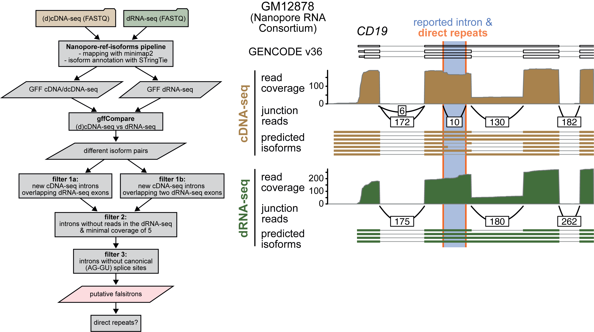

# Falsitron identification 

Main scripts for the paper: 

**Direct long-read RNA sequencing identifies a subset of questionable exitrons likely arising from reverse transcription artifacts**





Isoform annotation 
======================

The identification of isoforms from long read data is made following the [ONT pipeline based on StringTie and other tools](https://github.com/nanoporetech/pipeline-nanopore-ref-isoforms)

cDNA and directRNA reads are processed independently and using the default parameters of the pipeline. 

Falsitron search
================

We use the script `candidate_search.R` in the following manner: 

```bash
Rscript candidate_search.R <input_file>
```

The input file contains the following lines: 

- Library query 
- Library target
- path to gffcompare tracking file on the form: _query_target.tracking_
- path to gffcompare tracking file on the form: _target_query.tracking_
- path to the query GFF annotation file 
- path to the target GFF annotation file
- path to the query BAM file
- path to the target BAM file 
- output path including prefix to use on the output files

An example of this file is contained [here](data/example_input). 

**query** = Library with potential artifacts (usually cDNA)

**target** = Library to compare (usually dRNA)


The script will output the candidates under different filters, as described in the figure above. 


Repeat search
-------------------------------------

The script `repeat_search.R` is used to process the file with the filter F3 in order to seach for direct repeats in the candidates. 


